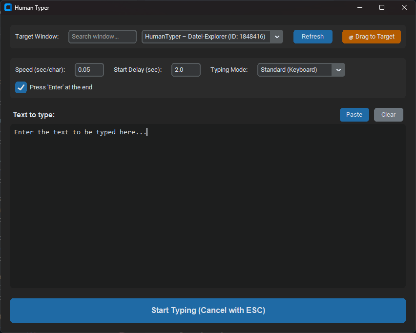

# HumanTyper ⌨️

HumanTyper is a modern desktop application built with Python and CustomTkinter that simulates human-like typing into any specific Windows application. 

It is especially useful for **bypassing pasting restrictions** (e.g., in virtual machines, remote desktop environments, VNC, or strict terminal consoles) by sending the keystrokes one by one directly to the OS.

<p align="center">
  
</p>

## ✨ Features

- **🎯 Drag to Target:** Simply click, drag, and drop the crosshair onto any open window to instantly select it as your typing target.
- **🔍 Search & Filter:** Easily find your target window in the dropdown using the integrated search box.
- **🌐 Multi-Compatibility (VNC Mode):** Includes a special "VNC/Remote (Alt-Codes)" engine that safely converts special characters (`|`, `@`, `\`, etc.) into Numpad Alt-Codes. This guarantees characters arrive correctly even if the local and remote keyboard layouts don't match!
- **⚙️ Adjustable Speed & Delay:** Configure exactly how fast the characters should be typed and set a start delay to give yourself time to click into the right text field before typing begins.
- **↩️ Auto-Enter:** Option to automatically send an 'Enter' keystroke at the very end of the typing process.
- **🛑 Emergency Abort:** Cancel the typing process at any time by pressing the `ESC` key.

## 🚀 Installation & Usage

### Prerequisites
- Python 3.8+ installed on your system.
- Windows OS (the application relies on `win32gui` for window targeting).

### Method 1: Quick Start (via Batch script)
1. Clone or download this repository.
2. Double-click the `start.bat` file. 
3. The script will automatically install all required dependencies (if missing) and start the application.

### Method 2: Manual Installation
1. Clone the repository:
   ```bash
   git clone https://github.com/yourusername/HumanTyper.git
   cd HumanTyper
   ```
2. Install the dependencies:
   ```bash
   pip install -r requirements.txt
   ```
3. Run the app:
   ```bash
   python main.py
   ```

## 📦 Building a Standalone Executable (.exe)

If you want to create a single `.exe` file that can be shared and run without requiring Python to be installed on the target machine:
1. Double-click the included `build.bat` script.
2. It will install PyInstaller and package the application.
3. Once finished, you will find your `main.exe` inside the newly created `dist/` folder. You can safely rename it to `HumanTyper.exe`.

## 📜 License

This project is free and unencumbered software released into the **Public Domain** (The Unlicense). 
Do whatever you want with it! Free for all, commercial or non-commercial. See the [LICENSE](LICENSE) file for more details.
